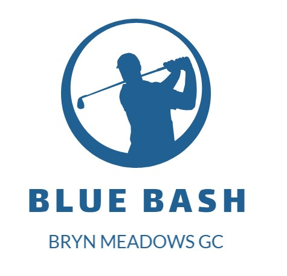

# Bryn Meadows Blue Bash Golf Society

Welcome to the Bryn Meadows Blue Bash Golf Society, a community of golf enthusiasts dedicated to enjoying the game and fostering camaraderie. Our society is all about bringing together players of different skill levels who share a passion for golf and a desire to have fun on the course.

## **Table Of Contents**

- [Bryn Meadows Blue Bash Golf Society](#bryn-meadows-blue-bash-golf-society)
  - [**Table Of Contents**](#table-of-contents)
  - [Project Scope](#project-scope)
  - [User Experience Design](#user-experience-design)
  - [First Time Visitor Goals](#first-time-visitor-goals)
  - [Returning Visitor Goals](#returning-visitor-goals)
  - [Frequent Visitor Goals](#frequent-visitor-goals)
  - [Structure](#structure)
  - [Design](#design)

## Project Scope

The scope of this project encompasses the creation of a website, which serves as the designated solution for accomplishing the inaugural Milestone Project mandated by the Code Institute's Full Stack Developer program. The project scope extends to the utilization and application of acquired knowledge from modules such as HTML, CSS, and User-Centric Design. For an exhaustive compilation of the technologies harnessed for the project's execution, kindly consult the technologies section within this documentation.

## User Experience Design

## First Time Visitor Goals

## Returning Visitor Goals

## Frequent Visitor Goals

## Structure

## Design
